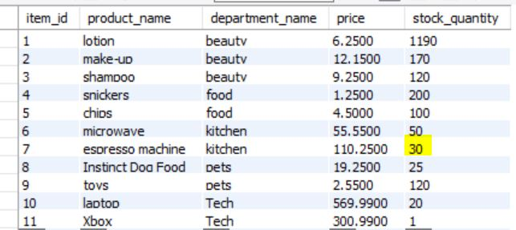

#Bamazon Customer View

Bamazon is an Amazon-like storefront build using node.js, mySQL and inquirer. The app will take in orders from customers and deplete stock from the store's inventory.

## Database Creation
1. Created a MySQL Database called bamazon.

2. Then created a Table inside of that database called products.

3. The products table has each of the following columns:
	
	*item_id (unique id for each product)
	*product_name (Name of product)
	*department_name
	*price (cost to customer)
	*stock_quantity (how much of the product is available in stores)

4. Populated this database with 11 different products. 

##Node Application
Created a Node application called bamazonCustomer.js. When first running this application, the user will get the option to view all inventory.

The app then prompts the user with two messages.
1. The first message asks them the ID of the product they would like to buy.

2. The second message asks how many units of the product they would like to buy.

Once the customer has placed the order, the application checks if the store has enough of the product to meet the customer's request.

If not, the app will log the phrase "Insufficient quantity!", and then prevent the order from going through.

If yes, mySQL database will reflect the remaining quantity after subtracting the amount of a product bought by the user.
The customer is given a total cost of their purchase.

